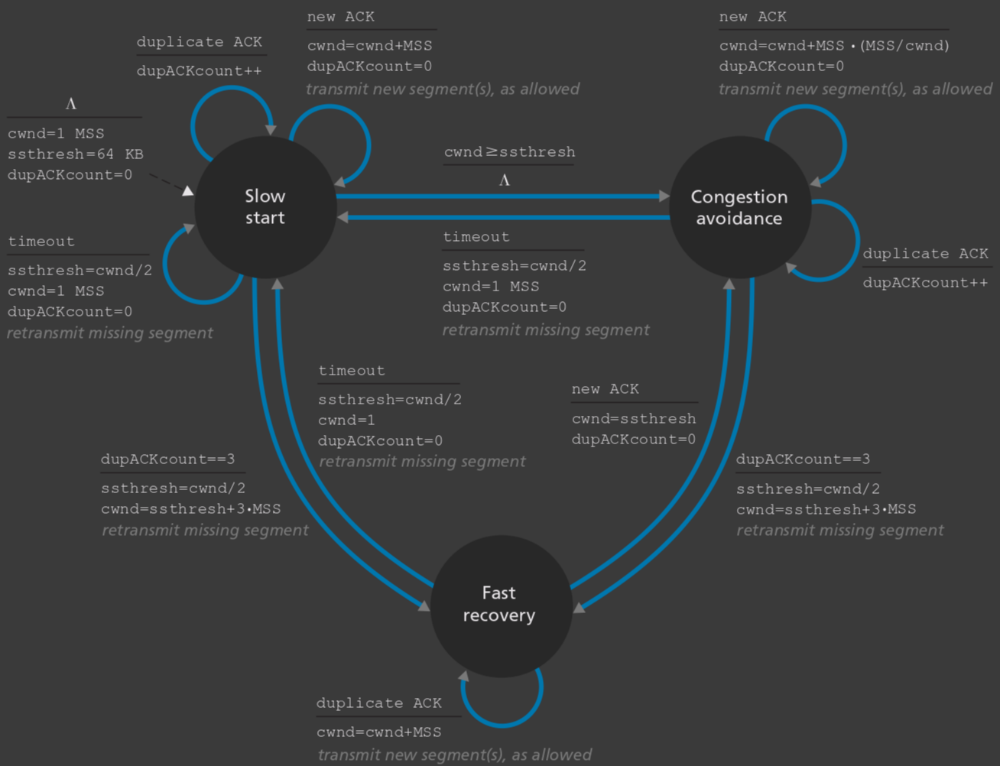
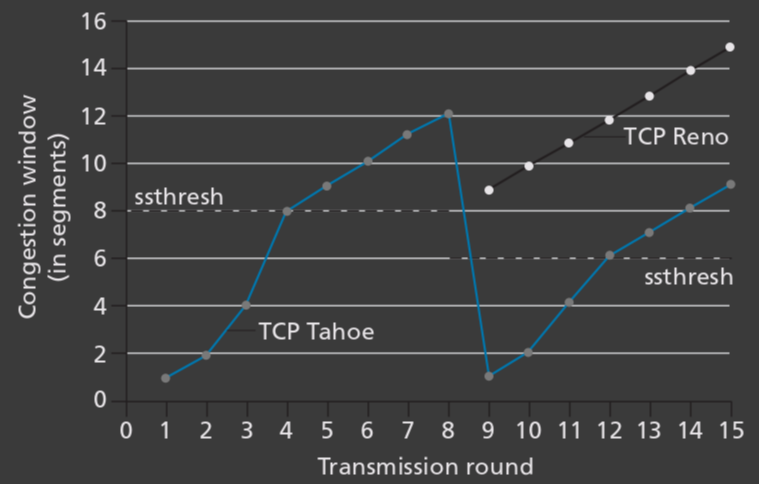

## Resumen

### Panorama

#### Ecosistema de Internet

- **ISPs (Internet Service Providers)**: Proveen acceso a Internet a usuarios finales y empresas.
    - **Tier 1 ISPs**: Proveen conectividad global y se interconectan entre sí sin costo.
    - **Regional ISPs**: Proveen conectividad dentro de una región específica.
    - **Access ISPs**: Proveen conectividad a usuarios finales y pequeñas empresas.
- **POPs (Points of Presence)**: Ubicaciones físicas donde los ISPs tienen infraestructura para conectar a los usuarios.
- **CPNs (Content Provider Networks)**: Proveen contenido y servicios en línea, como Google, Facebook, Amazon.
- **Data Centers**: Alojan servidores y servicios en la nube.
- **IXPs (Internet Exchange Points)**: Facilitan la interconexión entre diferentes ISPs.

#### Redes de Acceso

- **DSL (Digital Subscriber Line)**: Utiliza líneas telefónicas de cobre para transmitir datos, mediante multiplexación.
    - Del lado del usuario, se utiliza un módem DSL.
    - Del lado del ISP, se utiliza un DSLAM (Digital Subscriber Line Access Multiplexer).
- **Cable**: Utiliza la infraestructura de televisión por cable para proporcionar acceso a Internet.
    - Del lado del usuario, se utiliza un módem de cable.
    - Del lado del ISP, se utiliza un CMTS (Cable Modem Termination System).
- **Fibra óptica**: Utiliza cables de fibra óptica para transmitir datos a alta velocidad y gran ancho de banda.
    - Del lado del usuario, se utiliza un ONT (Optical Network Terminal).
    - Del lado del ISP, se utiliza un OLT (Optical Line Terminal).
- **Inalámbrico (WiFi, celular)**: Proporciona acceso a Internet a través de señales de radio.
    - Del lado del usuario, se utilizan dispositivos como smartphones, laptops, tablets.
    - Del lado del ISP, se utilizan estaciones base y torres de celular.

#### Métricas de Performance

##### Latencia

- **Tiempo de procesamiento**: Tiempo que tarda un paquete en ser procesado por un dispositivo de red (examinar el encabezado, realizar la verificación de errores, decidir por dónde enviarlo).
- **Tiempo de encolado**: Tiempo que espera un paquete desde que llega al router hasta que es finalmente transmitido. Depende de la congestión de la red y es muy variable.
- **Tiempo de inserción**: Tiempo que tarda un paquete en ser insertado en el enlace. Depende de la longitud del paquete $L$ y la tasa de transmisión del enlace $R$ ($L/R$).
- **Tiempo de propagación**: Tiempo que tarda un paquete en propagarse por el enlace de un router al próximo. Depende de la distancia del enlace $d$ y la velocidad de propagación $v$ ($d/v$)

##### Pérdida de paquetes

- **Intensidad de tráfico**: $I = L \cdot a / R$, donde $L$ es la longitud del paquete (bits), $a$ es la tasa de arribo promedio de paquetes (paquetes/segundo) y $R$ es la tasa de transmisión del enlace (bps).
    - Si $I > 1$, la intensidad de tráfico es alta y se generan colas largas y pérdida de paquetes.
    - Si $I < 1$, la intensidad de tráfico es baja y las colas son cortas o inexistentes.
- **Pérdida de paquetes**: Ocurre cuando la tasa de llegada de paquetes excede la capacidad del enlace, resultando en colas que se llenan y paquetes que son descartados.

##### Mediciones

- **Bandwidth**: Capacidad máxima de un enlace para transmitir datos, medida en bps.
- **Throughput**: Cantidad real de datos que se transmiten a través de la red en un período determinado de tiempo, en bps.
- **Round-Trip Time**: Tiempo que tarda un paquete de datos enviado desde un emisor en volver al mismo emisor habiendo pasado por el receptor de destino.
- **Enlace cuello de botella**: El enlace de menor throughput limita el rendimiento total de una ruta.
- **Jitter**: Variación en el tiempo que tarda un paquete de datos en viajar desde su origen hasta su destino, midiendo la fluctuación del retardo.

#### Herramientas

- **Ping**: Se usa para probar la accesibilidad de un host en una red IP.
- **Traceroute**: Se usa para rastrear la ruta que toma un paquete desde el origen hasta el destino.
- **Dig**: Se usa para consultar servidores DNS y obtener información sobre nombres de dominio (`dig @server domain type`).

#### Medios de transmisión

- **Cable de cobre (UTP, coaxial)**: Su velocidad de propagación es $\approx \frac{3}{4} C$.
- **Fibra óptica (vidrio)**: Su velocidad de propagación es $\approx \frac{2}{3} C$.
- **Inalámbrico (WiFi, celular)**: Su velocidad de propagación es $\approx C$.
    - **C**: Velocidad de la luz en el vacío, $\approx 3 \times 10^8$ m/s.

### Protocolos

- Define los tipos de mensajes intercambiados, su sintaxis, la semántica de los campos y las reglas sobre cuándo y cómo se envían y responden los mensajes.

#### Capa de Aplicación

##### HTTP (HyperText Transfer Protocol)

- Protocolo para la transferencia de documentos web, con diferentes versiones y características:
    - **HTTPS (HTTP Secure)**: Versión segura de HTTP que utiliza cifrado SSL/TLS.
    - **HTTP/1.0**: Conexiones no persistentes, una solicitud por conexión.
    - **HTTP/1.1**: Conexiones persistentes por defecto, múltiples solicitudes por conexión y sin necesidad de esperar (pipelining).
    - **HTTP/2**: Multiplexación de solicitudes y respuestas en una única conexión (framing), compresión de encabezados y priorización de solicitudes.
    - **HTTP/3**: Basado en QUIC, utiliza UDP en lugar de TCP para mejorar la velocidad y reducir la latencia.
- **HTTP Request**: Mensaje enviado por el cliente al servidor para solicitar un recurso.
    - **Solicitud**: método, URL, versión del protocolo.
    - **Encabezados**: información adicional sobre la solicitud, como tipo de navegador, idioma, etc.
    - **Cuerpo**: datos enviados al servidor (opcional).
- **HTTP Response**: Mensaje enviado por el servidor al cliente en respuesta a una solicitud.
    - **Línea de estado**: versión del protocolo, código de estado, mensaje de estado.
    - **Encabezados**: información adicional sobre la respuesta, como tipo de contenido, longitud, etc.
    - **Cuerpo**: datos enviados al cliente (opcional).
- **Web Caching**: Almacenamiento temporal de copias de recursos web para reducir la latencia y la carga en los servidores.
- **Cookies**: Pequeños archivos de texto almacenados en el navegador del usuario para mantener el estado y la información de sesión.

##### SMTP (Simple Mail Transfer Protocol)

- Protocolo para el envío de correos electrónicos.
- **Handshaking**: Intercambio inicial de mensajes para establecer una conexión entre el cliente y el servidor.
    - **Comandos**: Instrucciones enviadas por el cliente al servidor para realizar acciones específicas (ej. HELO, MAIL FROM, RCPT TO, DATA).
    - **Respuestas**: Mensajes enviados por el servidor al cliente para indicar el estado de la conexión y las acciones realizadas (códigos de estado).
- **Formato del mensaje**: Estructura del correo electrónico, que incluye:
    - **Encabezados**: `From`, `To`, `Subject`, `Date`, etc.
    - **Cuerpo**: Contenido del correo electrónico, que puede ser texto plano o HTML.
- **Componentes del correo electrónico**:
    - **User Agent (UA)**: Cliente de correo electrónico utilizado por el usuario final para enviar y recibir correos (ej. Outlook, Gmail).
    - **Mail Server**: Servidor que maneja el envío, recepción y almacenamiento de correos electrónicos.
    - **Protocolo IMAP/POP3**: Protocolos utilizados por los clientes de correo para recuperar correos desde el servidor.

##### DNS (Domain Name System)

- Sistema de nombres jerárquico y distribuido que traduce nombres de dominio legibles por humanos en direcciones IP numéricas. Ofrece:
    - **Alias de host**: Dado un alias, devuelve el nombre canónico del host y su dirección IP.
    - **Alias de servidor de correo**: Dado un alias de servidor de correo, devuelve su nombre canónico y dirección IP.
    - **Distribución de carga**: Devuelve el conjunto de direcciones IP asociadas a un único nombre de alias, rotando su orden en cada respuesta (load balancing con round-robin).
- **Infraestructura distribuida**: Evita un único punto de falla, permite escalabilidad y reduce la latencia.
- **Jerarquía de DNS**:
    - **Root DNS Servers**: Servidores raíz que conocen la ubicación de los servidores de dominio de nivel superior (TLD).
    - **TLD DNS Servers**: Servidores que manejan dominios de nivel superior como .com, .org, .net, .ar.
    - **Authoritative DNS Servers**: Servidores que contienen la información definitiva sobre un dominio específico.
- **LDNS (Local DNS Server)**: Servidor DNS cercano al usuario perteneciente al ISP que actúa como primer punto de contacto y almacena en caché las respuestas a consultas recientes para mejorar la velocidad de resolución de nombres (con un TTL).
- **Resolución de nombres**:
    - **Recursiva**: El servidor DNS local se encarga de resolver la consulta completa, contactando a otros servidores DNS si es necesario.
    - **Iterativa**: El servidor DNS local responde con la mejor información que tiene, y el cliente debe continuar la resolución contactando a otros servidores DNS.

###### Recursos y Mensajes DNS

- **Registro de recurso (RR)**: Entrada en la base de datos DNS que mapea un nombre de dominio a una dirección IP u otra información.
    - Formato: `Name | Value | Type | TTL | Class`
    - **Name**: Nombre de dominio o alias.
    - **Value**: Dirección IP u otro dato asociado al nombre.
    - **Type**: Tipo de registro (A, AAAA, CNAME, MX, NS).
    - **TTL (Time To Live)**: Tiempo en segundos que el registro puede ser almacenado en caché.
    - **Class**: Generalmente IN (Internet).
- **Tipos de registros DNS**:
    - **A**: Mapea un nombre de dominio a una dirección IPv4.
    - **AAAA**: Mapea un nombre de dominio a una dirección IPv6.
    - **CNAME**: Alias que apunta a otro nombre de dominio.
    - **MX**: Especifica los servidores de correo para un dominio.
    - **NS**: Indica los servidores de nombres autoritativos para un dominio.
- **Mensajes DNS**: Formato de los mensajes intercambiados entre clientes y servidores DNS.
    - **Encabezado** (12 bytes): 
        - Identificador de consulta de 16 bits (copiado en la respuesta).
        - Flags:
            - 1 bit para indicar si es consulta o respuesta.
            - 1 bit para respuesta autoritativa.
            - 1 bit para recursión deseada.
            - 1 bit para recursión disponible.
        - Cuatro contadores de 16 bits que indican el número de entradas en cada una de las cuatro secciones siguientes.
    - **Questions**: Sección que contiene la consulta realizada, incluyendo el nombre solicitado y el tipo de pregunta.
    - **Answer**: Sección que contiene los registros de recurso que responden a la consulta.
    - **Authority**: Sección que contiene registros que apuntan a otros servidores autoritativos.
    - **Additional**: Sección que puede contener información adicional relevante para la consulta.

##### CDN (Content Distribution Network)

- Red de servidores distribuidos geográficamente que almacenan en caché copias de contenido web para mejorar la velocidad de entrega y reducir la carga en los servidores de origen.
- **Funcionamiento**:
    - Los usuarios son redirigidos al servidor CDN más cercano o eficiente para acceder al contenido solicitado.
    - El servidor CDN almacena en caché el contenido y lo entrega rápidamente a los usuarios.
- **Beneficios**:
    - Reducción de la latencia.
    - Mejora de la disponibilidad y redundancia.
    - Disminución de la carga en los servidores de origen.
- **Estrategias de caché**:
    - **Push**: El contenido se envía proactivamente a los servidores CDN.
    - **Pull**: El contenido se obtiene del servidor de origen cuando un usuario lo solicita por primera vez.
- **Participación del DNS**: El DNS puede ser utilizado para redirigir a los usuarios al servidor CDN más cercano mediante técnicas como Anycast o GeoDNS.

##### DHCP (Dynamic Host Configuration Protocol)

- Protocolo que permite a los dispositivos obtener automáticamente una dirección IP y otros parámetros de configuración de red.
- **Funcionamiento**:
    - Un cliente DHCP envía un mensaje de descubrimiento (DHCPDISCOVER) para localizar servidores DHCP disponibles.
    - Un servidor DHCP responde con una oferta (DHCPOFFER) que incluye una dirección IP y otros parámetros.
    - El cliente acepta la oferta enviando una solicitud (DHCPREQUEST).
    - El servidor confirma la asignación enviando un mensaje de confirmación (DHCPACK).

#### Capa de Transporte

##### UDP (User Datagram Protocol)

- Protocolo de transporte no orientado a conexión, que proporciona un servicio de entrega de datagramas sin garantía de entrega, orden o integridad.
- **Encabezado UDP**: Compuesto por cuatro campos de 16 bits cada uno:
    - **Puerto de origen**: Identifica el puerto del proceso emisor.
    - **Puerto de destino**: Identifica el puerto del proceso receptor.
    - **Longitud**: Longitud total del datagrama UDP (encabezado + datos).
    - **Checksum**: Utilizado para la detección de errores en el encabezado y los datos.

##### TCP (Transmission Control Protocol)

- Protocolo de transporte orientado a conexión, que proporciona un servicio confiable, ordenado y sin pérdidas de entrega de un flujo de bytes entre aplicaciones.
- **Características principales**:
    - **Conexión orientada**: Establece una conexión antes de transmitir datos mediante un proceso de handshake de tres vías (SYN, SYN-ACK, ACK).
        - **SYN Cookie**: Mecanismo para proteger contra ataques de denegación de servicio (DoS) al evitar la creación de estados en el servidor hasta que la conexión esté completamente establecida.
    - **Control de flujo**: Utiliza una ventana deslizante para controlar la cantidad de datos que se pueden enviar sin recibir un acuse de recibo.
        - `rwnd = RcvBuffer - (LastByteReceived - LastByteRead)`.
        - Emisor: `LastByteSent - LastByteAcked <= rwnd`.
        - Receptor: `LastByteReceived - LastByteRead <= RcvBuffer`.
    - **Control de congestión**: Ajusta la tasa de envío de datos en función de la congestión de la red.
        - `cwnd`: Tamaño de la ventana de congestión.
        - `ssthresh`: Umbral para la transición entre los modos de Congestion Avoidance y Slow Start.
        - Regla: `LastByteSent - LastByteAcked <= min(cwnd, rwnd)`.
        - **Algoritmos**: TCP Tahoe (Slow Start, Congestion Avoidance, Fast Retransmit), TCP Reno (TCP Tahoe + Fast Recovery).
- **Encabezado TCP**: Compuesto por varios campos, entre ellos:
    - **Puerto de origen** (16 bits): Identifica el puerto del proceso emisor.
    - **Puerto de destino** (16 bits): Identifica el puerto del proceso receptor.
    - **Número de secuencia** (32 bits): Indica la posición del primer byte de datos en el segmento.
    - **Número de acuse de recibo** (32 bits): Indica el siguiente byte esperado por el receptor.
    - **Longitud del encabezado** (4 bits): Tamaño del encabezado TCP en palabras de 32 bits.
    - **Reservado** (6 bits): Reservado para uso futuro, debe ser cero.
    - **Flags** (6 bits): Bits que controlan la conexión (SYN, ACK, FIN, RST, PSH, URG).
    - **Ventana** (16 bits): Tamaño de la ventana para control de flujo.
    - **Checksum** (16 bits): Utilizado para la detección de errores en el encabezado y los datos.
    - **Puntero urgente** (16 bits): Indica la posición del último byte urgente en los datos.
    - **Opciones** (0-40 bytes): Campos adicionales para funcionalidades avanzadas.
- **Transferencia confiable**:
    - **Cliente**:
        - Al enviar un paquete, prende el temporizador si no está prendido.
        - Si llega un ACK, actualiza la ventana y reinicia el temporizador si hay datos pendientes.
        - Si expira el temporizador, retransmite el paquete y reinicia el temporizador con doble del tiempo.
        - Si recibe tres ACKs duplicados, retransmite el paquete (Fast Retransmit).
        - `
    - **Servidor**:
        - Si recibe un paquete con el número de secuencia esperado, envía un ACK y entrega los datos a la aplicación.
        - Si recibe un paquete fuera de orden, envía un ACK del último paquete recibido en orden.
        - Si recibe un paquete duplicado, reenvía el ACK correspondiente.

#### Capa de Red

##### IP (Internet Protocol)

- Protocolo de red que proporciona un servicio de entrega de datagramas sin garantía de entrega, orden o integridad.
- **Encabezado IPv4**: Compuesto por varios campos, entre ellos:
    - **Versión** (4 bits): Indica la versión del protocolo IP (IPv4 o IPv6).
    - **Longitud del encabezado** (4 bits): Tamaño del encabezado IP en palabras de 32 bits.
    - **Tipo de servicio** (8 bits): Indica la prioridad y el tipo de tráfico.
    - **Longitud total** (16 bits): Tamaño total del datagrama IP (encabezado + datos).
    - **Identificación** (16 bits): Identifica de manera única el datagrama.
    - **Flags** (3 bits): Controlan la fragmentación del datagrama (reservado, DF, MF).
    - **Desplazamiento de fragmento** (13 bits): Indica la posición del fragmento en el datagrama original, en unidades de 8 bytes.
    - **Tiempo de vida (TTL)** (8 bits): Limita la duración del datagrama en la red.
    - **Protocolo** (8 bits): Indica el protocolo de la capa de transporte (TCP, UDP, etc.).
    - **Checksum** (16 bits): Utilizado para la detección de errores en el encabezado.
    - **Dirección IP de origen** (32 bits): Dirección del host que envía el datagrama.
    - **Dirección IP de destino** (32 bits): Dirección del host que recibe el datagrama.
    - **Opciones** (0-40 bytes): Campos adicionales para funcionalidades avanzadas.

###### IPv6

- **Motivaciones**: Escasez de direcciones IPv4, necesidad de simplificar el encabezado y mejorar la eficiencia del enrutamiento.
- **Cambios principales**: 
    - Dirección de 128 bits en lugar de 32 bits.
    - Encabezado simplificado con menos campos y opciones, y longitud fija de 40 bytes.
    - Eliminación del checksum en el encabezado.
    - Identificación de flujos para mejorar la calidad de servicio.
    - La fragmentación es manejada solo por el emisor, no por los routers intermedios.
- **Encabezado IPv6**: Compuesto por varios campos, entre ellos:
    - **Versión** (4 bits): Indica la versión del protocolo IP (IPv6).
    - **Clase de tráfico** (8 bits): Indica la prioridad y el tipo de tráfico (análogo al TOS).
    - **Etiqueta de flujo** (20 bits): Identifica flujos de datos para tratamiento especial.
    - **Longitud del payload** (16 bits): Tamaño del payload (datos) del datagrama.
    - **Próximo encabezado** (8 bits): Indica el tipo de encabezado que sigue (protocolo de la capa de transporte).
    - **Límite de saltos (Hop Limit)** (8 bits): Similar al TTL en IPv4, limita la duración del datagrama en la red.
    - **Dirección IP de origen** (128 bits): Dirección del host que envía el datagrama.
    - **Dirección IP de destino** (128 bits): Dirección del host que recibe el datagrama.

### Capa de Aplicación

- **Objetivo**: Proveer servicios de red a las aplicaciones del usuario final.
- **Implementación**: Se hace en los endsystems (hosts), no en los routers.

#### Arquitecturas

- **Cliente-Servidor**: Un host siempre encendido (**servidor**) con una dirección IP fija y conocida recibe solicitudes de múltiples hosts (**clientes**). Se usan centros de datos para alojar servidores. Ejemplos: HTTP, SMTP.
- **P2P (Peer-to-Peer)**: Todos los nodos pueden actuar como clientes y servidores. Es autoescalable y rentable, pero menos confiable. Ejemplos: BitTorrent.

### Capa de Transporte

- **Objetivo**: Proveer comunicación lógica entre procesos de aplicaciones en diferentes hosts.
- **Implementación**: Se hace en los endsystems (hosts), no en los routers.

#### Protocolos de recuperación de errores

- **Stop-and-Wait**: El emisor envía un paquete y espera un acuse de recibo (ACK) antes de enviar el siguiente. Si no recibe el ACK en un tiempo determinado, retransmite el paquete.
- **Go-Back-N**: El emisor puede enviar múltiples paquetes sin esperar ACKs, pero debe mantener un límite (ventana). Si un paquete se pierde, el emisor retransmite ese paquete y todos los siguientes.
- **Selective Repeat**: Similar a Go-Back-N, pero el emisor solo retransmite los paquetes que no fueron reconocidos, permitiendo una mayor eficiencia.

#### Servicios ofrecidos

- **Servicios mínimos**:
    - **Multiplexación y demultiplexación**: Extiende la comunicación host-to-host a proceso-a-proceso usando puertos.
        - **Multiplexación**: El emisor combina datos de múltiples procesos en un solo flujo de datos, agregándoles una cabecera con puertos de origen y destino.
        - **Demultiplexación**: El receptor separa el flujo de datos en múltiples flujos, entregándolos a los procesos correspondientes según los puertos.
    - **Detección y corrección de errores**: Asegura la integridad de los datos mediante checksums.
- **Servicios adicionales**:
    - **Control de flujo**: Evita que un emisor rápido abrume a un receptor lento.
    - **Control de congestión**: Evita que demasiados paquetes inunden la red.
    - **Conexión confiable**: Asegura la entrega ordenada y sin pérdidas de los datos (ej. TCP).
    - **Conexión no confiable**: No garantiza la entrega ni el orden de los datos (ej. UDP).

#### Estimación de RTT y temporizadores

- **RTT (Round-Trip Time)**: Tiempo que tarda un paquete en ir del emisor al receptor y volver.
- **SampleRTT**: Medición individual del RTT para un paquete específico.
- **EstimatedRTT**: Estimación del RTT basada en mediciones anteriores.
    - Fórmula: `EstimatedRTT = (1 - α) * EstimatedRTT + α * SampleRTT`, donde `α` es un factor de suavizado (usualmente 0.125).
- **DevRTT**: Desviación del RTT, que mide la variabilidad del RTT a lo largo del tiempo.
    - Fórmula: `DevRTT = (1 - β) * DevRTT + β * |SampleRTT - EstimatedRTT|`, donde `β` es otro factor de suavizado (usualmente 0.25).
- **TimeoutInterval**: Tiempo que el emisor espera antes de retransmitir un paquete.
    - Fórmula: `TimeoutInterval = EstimatedRTT + 4 * DevRTT`.

#### Control de congestión

### Capa de Red

- **Objetivo**: Provee comunicación lógica entre hosts en diferentes redes.
    - **Plano de datos**: Funciones per-router que determinan cómo se envían los paquetes.
    - **Plano de control**: Lógica a nivel de red que determinan la ruta que deben seguir los paquetes.
- **Implementación**: Se hace en los routers y en los endsystems (hosts).
- **Best-effort delivery**: No hay garantía de entrega, orden o integridad de los paquetes, ni de ancho de banda mínimo.

#### Componentes del router

- **Input ports**: Reciben los paquetes entrantes, realizan el procesamiento inicial (verificación de errores, extracción de la dirección de destino) y encolan los paquetes para su envío.
- **Switching fabric**: Mecanismo interno que conecta los puertos de entrada con los puertos de salida, permitiendo la transferencia de paquetes entre ellos.
    - Puede ser por memoria, bus o red de interconexión.
- **Output ports**: Desencolan los paquetes, realizan el procesamiento final (adición de la cabecera de enlace, verificación de errores) y transmiten los paquetes a través del enlace de salida.
    - Incluyen algoritmos de selección como FIFO, Priority Queuing, Round Robin, Weighted Fair Queuing.

#### Tabla de ruteo

- Tabla que mantiene cada router para decidir a qué siguiente salto (next hop) enviar un paquete basado en su dirección de destino.
- **Configuración**:
    - **Tradicional**: Cada router calcula localmente su tabla de ruteo.
    - **SDN (Software-Defined Networking)**: Un controlador centralizado calcula las rutas y las distribuye a los routers.
- **Estructura**:
    - **Destino**: Dirección de red del destino.
    - **Máscara**: Tamaño del prefijo de la red.
    - **Next Hop**: Dirección del siguiente router en la ruta hacia el destino.
    - **Interfaz de salida**: Puerto del router por donde se envía el paquete.
- **Funcionamiento**:
    - Cuando un paquete llega a un router, este busca en su tabla de ruteo para encontrar la mejor coincidencia con el prefijo del destino (la más específica).
    - El paquete se envía a través de la interfaz de salida correspondiente al siguiente salto.
- **Forwarding**:
    - **Destination-based forwarding**: El router utiliza la dirección de destino del paquete para buscar en la tabla de ruteo y determinar el siguiente salto.
    - **Generalized forwarding**: El router puede utilizar otros criterios además de la dirección de destino, como la calidad del servicio (QoS) o políticas específicas.

#### Direccionamiento IP

- **Classful addressing**: División de direcciones IP en clases (A, B, C, D, E) basadas en los primeros bits de la dirección, de 8, 16 o 24 bits para la porción de red.
- **Classless Inter-Domain Routing (CIDR)**: Permite una asignación más flexible de direcciones IP mediante el uso de prefijos de longitud variable (VLSM), representados en notación de barra (ej. /24).
- **Subredes**: División de una red IP en múltiples redes más pequeñas para mejorar la gestión y seguridad.

#### Conectividad

- **Unicast**: comunicación uno a uno; un emisor envía datos directamente a un único receptor específico mediante un socket.
- **Broadcast**: comunicación uno a todos; un emisor envía datos a todos los nodos de la red sin distinción.
- **Multicast**: comunicación uno a muchos seleccionados; un emisor envía datos a un grupo de receptores.
- **Anycast**: comunicación uno a uno-de-varios; un emisor envía datos a la dirección compartida por varios receptores, y la red los entrega al nodo más cercano o más eficiente.

#### Middleboxes

- Dispositivos intermedios en la red que realizan funciones adicionales más allá del simple enrutamiento de paquetes.
- **Tipos de middleboxes**:
    - **NAT (Network Address Translation)**: Traduce direcciones IP privadas a públicas y viceversa.
        - **Críticas**: Rompen con lo de usar direcciones para hosts y puertos para procesos, y obligan a los routers a inspeccionar el contenido de los paquetes.
    - **Security Services**: Filtran tráfico no deseado y protegen la red contra amenazas.
    - **Performance Enhancement**: Compresión, cacheo, balanceo de carga.
